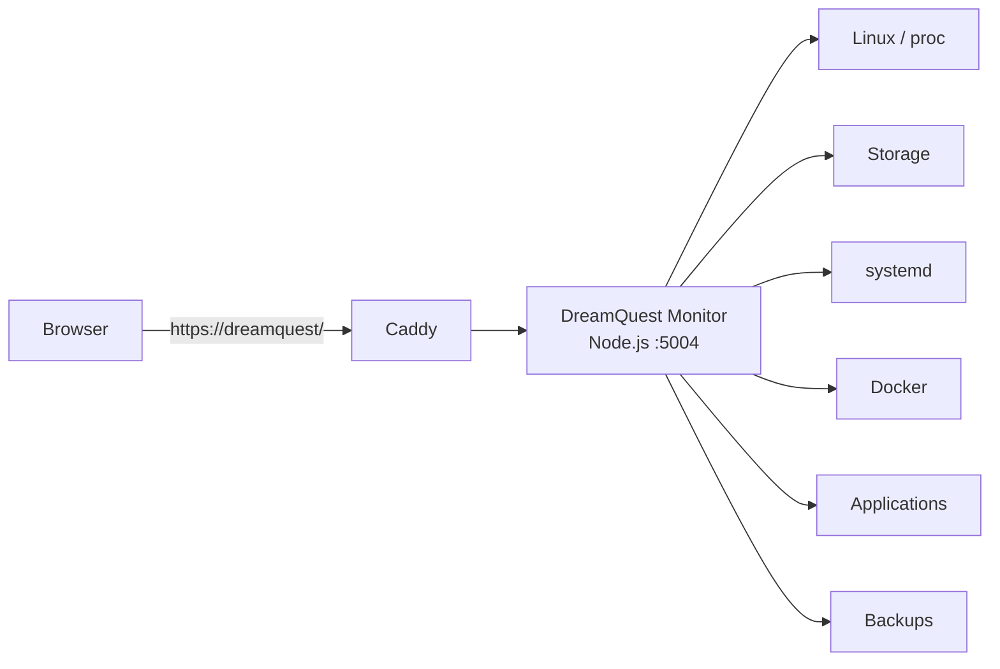

# DreamQuest Monitor

A lightweight, read-only monitoring dashboard for the DreamQuest home server.

The application provides a quick overview of server health without requiring a full monitoring stack such as Prometheus and Grafana.

It is designed to answer one question:

> **Is DreamQuest healthy, and if not, what needs attention?**

## Overview

DreamQuest Monitor is a small Node.js application using:

- Node.js 22
- Express
- Nunjucks
- systemd
- Caddy

It runs locally on DreamQuest and is exposed by Caddy as the server's default web page:

```text
https://dreamquest/
```

The application itself listens only on:

```text
127.0.0.1:5004
```

## Architecture



The monitor is intentionally **read-only**. It observes the server but does not restart services, modify configuration or perform administrative actions.

## Dashboard

The dashboard currently displays:

### System

- uptime
- system load
- memory usage
- CPU temperature

### Storage

Monitors:

```text
/srv/storage
/srv/backup
```

For each disk the dashboard shows:

- whether the filesystem is mounted
- used space
- total space
- percentage used

Current thresholds:

```text
< 80%     OK
80–89%    WARNING
>= 90%    ERROR
```

### Services

The following systemd services are checked:

- Caddy
- Samba
- MongoDB
- PostgreSQL
- Docker
- Syncthing

### Applications

HTTP checks are performed against:

- AuthZ
- Proverbs
- Activus
- Foodz

Application checks use localhost endpoints where possible so that application health can be distinguished from Caddy or DNS problems.

### Docker

Running Docker containers and their reported state are displayed.

An unhealthy container causes an error state.

### Backups

The monitor inspects:

```text
/srv/backup/snapshots
```

and reports the age of the most recent backup.

Currently a backup older than 14 days produces a warning.

## Overall Health

The indicator in the upper-right corner summarizes all monitored components.

Possible states are:

```text
OK
WARNING
ERROR
```

The current algorithm is:

```text
Any ERROR   → ERROR
No errors,
any warning → WARNING
Otherwise   → OK
```

Therefore a single failed service, unavailable application, missing filesystem or unhealthy Docker container can cause the overall dashboard to show `ERROR`.

The individual dashboard sections identify the component responsible.

## Endpoints

### Dashboard

```text
GET /
```

Displays the monitoring dashboard.

### Health

```text
GET /health
```

Used by the DreamQuest deployment system.

Example response:

```json
{
  "status": "ok"
}
```

An overall error causes the endpoint to return HTTP `503`.

### Status API

```text
GET /api/status
```

Returns the collected monitoring information as JSON.

This endpoint can be used later for dynamic dashboard updates or other integrations.

## Configuration

Production configuration:

```text
/etc/monitor/monitor.env
```

Current configuration:

```text
PORT=5004
STORAGE_ROOT=/srv/storage
BACKUP_ROOT=/srv/backup
```

The application is installed under:

```text
/srv/storage/apps/monitor
```

## systemd

Service:

```text
dreamquest-monitor.service
```

Check status:

```bash
systemctl status dreamquest-monitor --no-pager
```

Restart:

```bash
sudo systemctl restart dreamquest-monitor
```

Logs:

```bash
journalctl -u dreamquest-monitor -n 100 --no-pager
```

Follow logs:

```bash
journalctl -u dreamquest-monitor -f
```

## Deployment

DreamQuest Monitor uses the common DreamQuest deployment system.

From the Windows development machine:

```powershell
.\deploy.ps1 Monitor
```

If PowerShell script execution is restricted:

```powershell
powershell -ExecutionPolicy Bypass -File .\deploy.ps1 Monitor
```

Deployment configuration is stored in:

```text
deploy.apps.json
```

The deployment health check uses:

```text
http://127.0.0.1:5004/health
```

## Caddy

DreamQuest Monitor is the default application for:

```text
https://dreamquest/
```

Specific path-based applications such as AuthZ and Proverbs are handled before the monitor catch-all.

Conceptually:

```caddy
dreamquest {
    handle_path /authz/* {
        reverse_proxy 127.0.0.1:5000
    }

    handle_path /proverbs/* {
        reverse_proxy 127.0.0.1:5001
    }

    handle {
        reverse_proxy 127.0.0.1:5004
    }
}
```

## Security

The monitor is designed to require minimal privileges.

It:

- runs as user `luka`
- listens only on localhost
- is exposed through Caddy
- performs read-only monitoring
- does not provide administrative actions
- does not run as root

Additional privileges should only be added when required for a specific read-only monitoring function.

---

# ToDo

## Improve Overall Health Indicator

Instead of simply displaying:

```text
ERROR
```

show the number of detected problems:

```text
✓ Healthy
⚠ 2 warnings
✕ 1 issue
```

Allow clicking the indicator to jump directly to the affected component.

## Distinguish Required and Optional Services

Not every installed service needs to be running.

For example, PostgreSQL is currently installed but unused.

Add configuration such as:

```javascript
{
  name: 'PostgreSQL',
  required: false
}
```

An inactive optional service should display:

```text
INACTIVE
```

rather than causing DreamQuest to be considered unhealthy.

## Better Application Health Checks

Give every custom application a dedicated:

```text
/health
```

endpoint.

Health checks should eventually distinguish between:

- process available
- database available
- dependencies available
- degraded state

## SMART Disk Health

Add SMART monitoring for the IronWolf disks.

Display:

- SMART overall health
- temperature
- power-on hours
- reallocated sectors
- pending sectors

Avoid running the web application as root.

If `smartctl` requires elevated privileges, grant only the minimum read-only command permissions required.

## Backup Status

Improve backup monitoring by recording successful backup completion explicitly rather than relying only on filesystem modification timestamps.

Possible status:

```text
Last successful backup
2026-08-25 14:32

Age
3 hours

Duration
27 minutes

Data transferred
14.2 GB
```

The future automated backup process could write a small status file consumed by the monitor.

## Docker Presentation

Group Docker containers by application.

For example:

```text
Immich
  Server             OK
  Machine Learning   OK
  PostgreSQL         OK
  Valkey             OK

Jellyfin             OK
```

This would be easier to understand than displaying raw container names.

## Root Filesystem

Add `/` filesystem usage separately from `/srv/storage`.

The internal SSD should generate warnings before it becomes critically full.

## Swap

Display:

- swap total
- swap used

This may help identify unusual memory pressure.

## System Updates

Show whether Ubuntu package updates are available.

Possible display:

```text
Updates
12 available

Reboot required
No
```

This should be informational rather than running updates from the dashboard.

## Failed systemd Units

Add:

```bash
systemctl --failed
```

to the dashboard.

Unexpected failed units should produce a warning or error even when they are not part of the predefined service list.

## Refresh Without Page Reload

Replace the current 60-second HTML refresh with JavaScript polling of:

```text
/api/status
```

This would update status cards without reloading the entire page.

## Better Failure Details

Allow a failed component to show useful diagnostic information.

For example:

```text
Foodz
ERROR

HTTP health check failed
127.0.0.1:5003
Connection refused
```

Keep diagnostics read-only and avoid exposing secrets or complete logs.

## Monitoring History

Eventually retain a small amount of historical information for:

- disk usage
- memory usage
- temperature
- application availability
- backup age

Avoid introducing a large metrics database unless the need justifies it.

A small SQLite database would likely be sufficient.

## Alerts

Add notifications only for conditions requiring attention:

- primary storage unavailable
- SMART failure
- filesystem almost full
- application repeatedly unavailable
- unhealthy Docker container
- backup overdue

Routine healthy status should not generate notifications.

## Mobile Layout

Improve the compact layout for checking DreamQuest quickly from a phone.

## Navigation

Add convenient links to locally hosted applications:

```text
Activus
Foodz
Immich
Jellyfin
Proverbs
```

The monitor can then also act as the DreamQuest home portal.

## Authentication

The current read-only LAN dashboard does not require its own authentication.

If administrative actions are ever added, authentication and authorization must be introduced before those features are enabled.

## Administrative Actions

Possible future actions include:

```text
Restart application
Restart container
Run backup
```

These should **not** be implemented until authentication, authorization, auditing and tightly scoped privileges have been designed.

The monitoring dashboard should remain read-only by default.